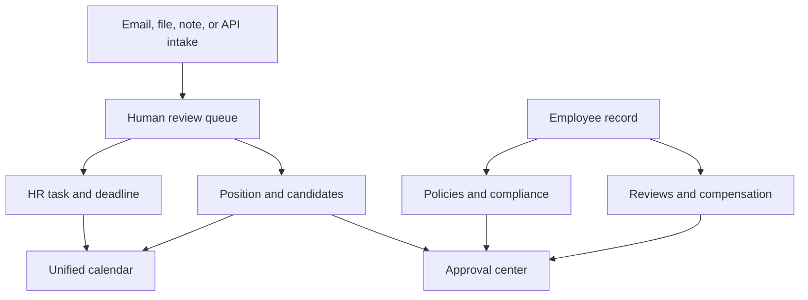
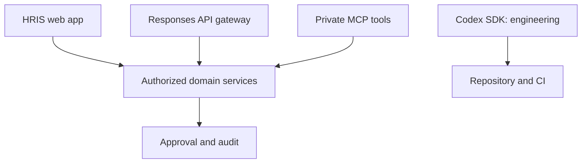

# Daniel's HR Command Center

## Master Implementation Roadmap and Build Contract for Carl (Cursor AI)

**Document owner:** Daniel Alexander  
**Primary implementation agent:** Carl (Cursor AI)  
**Document status:** Planning baseline; Phase 1 application code requires Phase 0A approval and a private repository  
**Last updated:** August 5, 2026  
**Revision:** 1.4 — Phase 0A/0B split, repo operating docs, worker security, Drive OAuth correction  
**Primary timezone:** America/New_York  
**Phase 0 working docs:** `docs/phase-0/` · Agent rules: `AGENTS.md` · Overview: `README.md`  

---

## 1. Purpose of this document

This document is the build contract for Daniel's custom HR and recruiting suite, referred to here as **Daniel's HR Command Center**. Its purpose is to prevent the project from turning into a large collection of partially connected features, premature integrations, duplicated data, and difficult-to-debug automation.

Carl should use this roadmap to build the system in controlled phases. Each phase must deliver a coherent, testable vertical slice and must pass its acceptance gate before the next phase begins. Passing a phase means more than making the interface appear complete. The data model, permissions, error handling, tests, documentation, deployment behavior, and rollback path must also be complete.

This plan intentionally starts with discovery and integration proofs before major coding. The system will handle employee records, candidate resumes, compensation data, email content, compliance materials, and other sensitive information. Incorrect assumptions about APIs, access permissions, data ownership, or security cannot be repaired cheaply after the application has been built around them.

---

## 2. The product outcome

The finished product should be a personal HR operating system that sits above Daniel's existing tools and connects the records and work that are currently spread across them.

It should provide one place to see and act on:

- Active positions and recruiting deadlines
- Candidate matches and resumes
- Standardized job descriptions and sourcing searches
- HR tasks detected from email
- Draft email replies and explicit send actions
- Daily meetings and HR deadlines
- Compliance obligations and preparation work
- Performance-review and compensation workflows
- Employee operational records
- Handbook and policy versions
- Approvals, reminders, evidence, documents, and audit history
- Embedded OpenAI-assisted extraction, drafting, matching, summaries, and natural-language retrieval
- Controlled ChatGPT/Codex access to live HRIS records and approved actions through a private MCP interface

The most important product principle is that these are not isolated dashboard cards. They are connected records. A source email can produce a draft position, a task, a deadline, and a calendar event while all of those records remain linked to the original source and to one another.

The second product principle is that intelligence and authority are separate. OpenAI may classify, extract, compare, recommend, draft, and translate natural language into a proposed query or action. The HR Command Center remains responsible for permissions, validation, record state, approval, execution, and audit. Codex must never receive unrestricted database credentials or become a hidden alternate path around the Approval Center.



---

## 3. Product boundaries and baseline decisions

These boundaries are part of the initial architecture. Carl must not silently expand them.

### 3.1 What this system is

- An operational command center for Daniel's HR and recruiting work
- A secure aggregation and workflow layer over existing systems
- A system for tracking work, decisions, deadlines, related records, and evidence
- A human-approved automation system
- A place to prepare drafts and proposed actions before sending or publishing

### 3.2 What this system is not in the first release

- A replacement for ADP Workforce Now as the payroll or benefits system of record
- A replacement for JazzHR as the applicant tracking system of record
- A replacement for Gmail, Google Calendar, or Google Drive
- An autonomous agent that sends email, publishes positions, changes compensation, or distributes policies without review
- A full document-management system
- A general-purpose employee-relations case-management platform
- A multi-company SaaS product
- A job-board scraper or automated bot that violates a third-party site's terms

### 3.3 Baseline implementation decisions

Unless Daniel explicitly changes them during Phase 0, use these defaults.

**Locked in Daniel's Phase 0 decision response (2026-08-05) unless Phase 0 finds a concrete incompatibility:**

| Decision | Baseline |
| --- | --- |
| Repository posture | Greenfield in this repo; do not hunt for an existing Next.js/HRIS codebase here |
| Existing Review / Compensation / GAS systems | External reference implementations — inventory and link; do not migrate or rewrite in Phase 0–1 |
| Initial audience | Daniel only for Phases 1–9 operating scope |
| Future audience | Selected AITHERAS users with role-based access after separate acceptance |
| Authentication | Supabase Auth with Google OAuth, restricted to an approved AITHERAS account allowlist |
| Authorization | Role-based architecture from the start; only the Administrator role exposed initially; exercise deny paths with a second non-production test account |
| Primary timezone | America/New_York, stored internally as UTC where timestamps are required |
| Email actions | Draft and review first; sending always requires a final explicit click |
| Calendar actions | Read-only first; creating or changing events requires explicit confirmation |
| AI actions | AI produces suggestions with confidence and source evidence; humans approve material actions |
| Embedded AI runtime | Central server-side AI Gateway using the OpenAI Responses API and strict structured outputs |
| Phase 0 OpenAI posture | Design matrix only; no live OpenAI calls or credential requirement until org/project/billing are provisioned |
| Sensitive AI persistence | Default `store: false`; any different retention behavior requires a documented, approved exception |
| ChatGPT/Codex connectivity | Private authenticated MCP interface after the core HRIS API and authorization model are stable |
| MCP hosting | Decide private MCP hosting shape in Phase 0; Phase 9 is the implementation/pilot gate, not the first architecture discussion |
| AI tool authority | Separate read tools, draft/proposal tools, and action tools; action tools always pass through normal permissions and approvals |
| Codex SDK | Deferred until repository, CI, and tests stabilize; engineering automation only — not the production HR workflow engine |
| External systems | Read-first integrations; writes are introduced separately and only where justified |
| Architecture | Modular monolith, not microservices |
| Application hosting | Next.js + TypeScript deployed on Vercel; Vercel is the UI and short-lived API/webhook layer, not the durable job-execution system |
| Database | PostgreSQL via Supabase |
| Durable jobs | Shortlist Inngest and Trigger.dev; Carl recommends Trigger.dev in `docs/phase-0/QUEUE_DECISION_MEMO.md` pending Daniel approval. Do not use Vercel functions as the durable worker |
| JazzHR | API-key/plan access and résumé-byte retrieval are a **Phase 0B hard gate for candidate matching**; they do **not** block Phase 1 secure-shell work after Phase 0A approval |
| Sensitive files | Keep authoritative copies in the approved source repository; avoid uncontrolled duplication |
| ADP | No direct write integration in the initial roadmap |
| Job boards | Generate searches and outreach content; do not automate prohibited browsing or scraping |
| Phase 1 product posture | Clean Daniel-only shell with manual intake and linked records; automation is earned later through proven integrations |
| Evaluation datasets | Schema and collection process in Phase 0; large curated sets do not block the manual vertical slice; grading and unattended email classification require labeled examples and agreed thresholds |

### 3.4 Systems of record

The application must label the authoritative source for each important data category.

| Data category | Initial system of record | Command Center behavior |
| --- | --- | --- |
| Payroll and benefits enrollment | ADP | Link, summarize approved fields, and track operational follow-up; no silent overwrites |
| Applicant and recruiting history | JazzHR | Synchronize approved metadata, retain source identifiers, and link back to the ATS |
| Email messages and threads | Gmail | Store source IDs, links, minimal necessary metadata, and approved derived records |
| Meetings | Google Calendar | Read and display; create HRIS-owned events only after approval |
| Working documents and evidence | Approved Google Drive locations | Store references, access-controlled links, versions, and necessary cached derivatives |
| Performance reviews | Existing review system until migration is approved | Integrate status and links before considering a native rewrite |
| Compensation adjustments | Existing compensation system until migration is approved | Integrate status and links with restricted visibility |
| Operational task state | HR Command Center | Authoritative for task status, ownership, due dates, and workflow history |
| Compliance register | Existing approved register, then HR Command Center after validated import | Import with source traceability and maintain evidence and deadlines |
| Handbook policy text | Approved handbook source and versions | Support controlled editing, approval, export, and distribution |
| AI suggestions and generated drafts | HR Command Center | Derived, non-authoritative records until accepted or approved by an authorized human |
| Application source code and engineering history | Git repository and CI/CD platform | Codex may assist through normal repository controls, review, tests, and deployment approvals |

---

## 4. Recommended technical architecture

The final choice is confirmed in Phase 0, but the recommended default is a TypeScript-based modular monolith that can be deployed and maintained without a large engineering team.

### 4.1 Recommended application shape

- **Frontend and application server:** Next.js with TypeScript
- **Application hosting:** Vercel for the Next.js application, authenticated API routes, preview deployments, environment separation, and short-lived webhook/API work
- **Database:** PostgreSQL via Supabase
- **Authentication:** Google OAuth through Supabase Auth, restricted by AITHERAS allowlist
- **Authorization:** Server-enforced role and permission checks; never UI-only checks
- **File references:** Google Drive or the existing authoritative repository for originals; controlled application storage only when required
- **Scheduled work:** Vercel Cron may *initiate* periodic work, but durable execution belongs in a queue/job runner (Trigger.dev recommended; Inngest acceptable with step constraints) backed by a persistent job table, retries, idempotency keys, dead-letter handling, and failure visibility. Do not rely on a single Vercel function invocation for long-running work, bulk processing, retry chains, or recovery.
- **AI services:** Server-side only, behind a provider-agnostic interface, with source citations, confidence, and approval states
- **OpenAI implementation:** A centralized AI Gateway using the Responses API, strict JSON schemas, prompt versioning, redaction, usage tracking, timeouts, and feature flags
- **ChatGPT/Codex interface:** A private remote MCP server introduced only after HRIS authorization is stable; every tool calls the same application services used by the UI
- **Engineering automation:** Optional Codex SDK workflows for code review, test diagnosis, migrations, and maintenance, isolated from production HR decision-making
- **Deployment:** Vercel development/preview, staging, and production environments with separate database, OAuth callback, secret, and job-runner configuration; production deployments require a documented rollback path
- **Testing:** Unit, integration/contract, and Playwright end-to-end tests
- **Observability:** Structured logs, sync-run history, user-visible error states, and alerting for failed scheduled jobs

### 4.2 Why a modular monolith

The project has many modules but a small expected user base and one primary operator. Microservices would add deployment, authentication, networking, and debugging overhead without providing useful scale. The codebase should be separated by domain boundaries while remaining one deployable application.

### 4.3 Hosting and background-work boundary

Vercel is the default platform for the web application. It should host the dashboard, authenticated UI, normal API routes, lightweight integration webhooks, and deployment pipeline. It must **not** be treated as a guaranteed always-running worker.

Carl must choose and document a durable queue/job service in Phase 0 (for example, a managed queue or workflow runner compatible with the selected stack). The service must own jobs such as nightly Gmail scanning, paginated JazzHR syncs, résumé parsing batches, webhook reconciliation, retries, bulk handbook distribution, and scheduled follow-ups. Vercel Cron may enqueue or reconcile work, but it may not be the only safeguard against a missed or partial job.

Every background job must have a job record, deterministic idempotency key, attempt count, state, source/target identifiers, last error, next retry time, and a visible freshness/failed-run status in the HRIS. A job may be replayed safely without sending duplicate messages, creating duplicate records, or repeating an external action.

Suggested high-level code boundaries:

```text
src/
  app/
  components/
  domains/
    approvals/
    audit/
    candidates/
    compliance/
    employees/
    handbook/
    positions/
    reviews/
    tasks/
  integrations/
    adobe/
    google-calendar/
    google-drive/
    gmail/
    jazzhr/
    legacy-compensation/
    legacy-reviews/
  ai/
    gateway/
    prompts/
    schemas/
    evals/
  mcp/
    auth/
    tools/
  jobs/
  lib/
  server/
  test/
```

The exact folder structure may differ after the repository audit, but UI components must not call external APIs directly. External systems must be accessed through integration adapters. Business rules must remain in domain services rather than being scattered through pages, API routes, and components.

### 4.4 Data flow standard

All external intake should follow the same general sequence:

1. Receive or fetch source data.
2. Record a sync run and stable source identifier.
3. Store only the necessary raw metadata or a controlled raw payload when required for audit/debugging.
4. Normalize into internal records through a deterministic mapper.
5. Run rule-based extraction first.
6. Run AI analysis only where it adds value.
7. Create a suggestion, not a final action.
8. Show source evidence and confidence to Daniel.
9. Convert the suggestion into an approved record or action.
10. Log the approval, result, external ID, and any error.

### 4.5 Integration adapter requirements

Every integration must expose an internal interface and hide vendor-specific behavior. At minimum, adapters should define:

- Connection verification
- Authorization and token refresh behavior
- Pagination
- Rate-limit handling
- Read operations
- Write operations, if approved
- Stable external identifiers
- Idempotency behavior
- Error normalization
- Retryability classification
- Last successful synchronization
- Data-deletion or revocation behavior

Carl must not spread vendor response objects directly through the application. Normalize them at the integration boundary.

### 4.6 OpenAI, MCP, and Codex boundaries

The architecture has three distinct layers. Carl must not collapse them into one generic “AI agent.”

1. **Embedded HRIS intelligence — OpenAI Responses API.** The application uses a server-side AI Gateway for email classification, structured extraction, candidate evidence and matching, JD standardization, sourcing queries, drafting, summaries, compliance preparation, handbook comparison, and natural-language query planning. Every production workflow uses a versioned schema and records its source IDs, prompt version, model identifier, outcome, and human disposition.
2. **ChatGPT/Codex access to the HRIS — private MCP server.** After the internal API, permissions, and audit trail are mature, expose narrowly scoped tools that allow ChatGPT or Codex to search and retrieve authorized HRIS records and create draft proposals. Begin read-only. Add draft tools only after read-only authorization tests pass. Add action tools only when they invoke the existing Approval Center and cannot directly bypass it.
3. **Codex engineering automation — Codex SDK.** Use Codex for coding-focused work such as repository analysis, test and CI diagnosis, migrations, code review, and controlled maintenance. The Codex SDK is not required to power ordinary HR functions and must not be given production HR data merely because it can operate on the repository.



The HRIS must not depend on this chat's conversational memory. Durable company rules, candidate-grading criteria, approved policy context, prompt templates, and decision history must be stored as explicit, permissioned, versioned application records.

---

## 5. Security, privacy, and approval rules

This system will handle personally identifiable information and confidential HR records. Security is not a final hardening phase; it is part of every phase.

### 5.1 Data classification

Use at least these classifications:

| Classification | Examples | Default handling |
| --- | --- | --- |
| Internal | Position status, general tasks, sourcing queries | Authenticated access; normal audit logging |
| Confidential | Candidate resumes, email content, employee documents | Restricted access, encrypted transport/storage, minimized copies |
| Highly restricted | Compensation, medical/benefits issues, employee-relations records, identity documents | Separate permissions, limited display, no broad search indexing, enhanced audit logging |
| Public/approved | Published job descriptions and approved handbook text | May be exported or shared only after approval |

### 5.2 Non-negotiable controls

- Secrets and OAuth refresh tokens are server-side only.
- No API key, access token, or sensitive environment variable may appear in client bundles, logs, screenshots, seeded data, fixtures, or commits.
- Every server operation must verify the authenticated user and permission.
- Compensation and employee-relations information must have narrower permissions than general employee data.
- Production data must never be copied into local development or automated tests.
- Tests must use fabricated, anonymized fixtures.
- The application must record who performed every material action and when.
- AI prompts and outputs containing sensitive information must follow an approved data-handling policy. If an approved provider and retention configuration are not established, AI processing of that category remains disabled.
- OpenAI API keys must be scoped to the appropriate server-side project/environment and must never be exposed to browser code, MCP clients, logs, or prompt content.
- Sensitive Responses API requests default to `store: false`. The data sent must be minimized and, where practical, redacted or replaced with internal identifiers.
- Email, resumes, attachments, and retrieved MCP content are untrusted input. Their text can provide evidence but can never redefine system instructions, permissions, recipients, or approval requirements.
- MCP tools must authenticate the caller, authorize each requested resource and operation, validate typed input, limit returned fields, and create audit events. Possession of MCP access is not blanket authorization.
- Read tools may retrieve only authorized data. Draft tools may create proposed content. Action tools may create approval requests but may not independently send, publish, submit, sign, delete, or change compensation.
- Email sending, calendar event creation, position publication, candidate submission, policy publication, and handbook distribution require explicit approval.
- The system must show the exact recipients, subject, attachments, and body immediately before an email is sent.
- Deleting records must be recoverable where practical and must not silently delete authoritative source records.
- Integration access must be revocable from the Settings page or through documented administrative steps.

### 5.3 Audit-event minimum fields

Every material action should generate an append-only audit event with:

- Event ID
- Timestamp
- Actor user ID
- Action type
- Entity type and entity ID
- Before/after summary where appropriate
- Source system
- External record ID when applicable
- Correlation/request ID
- Approval ID when applicable
- AI run, prompt version, or MCP tool-invocation ID when applicable
- Model/provider identifier and tool name when applicable
- Success or failure result
- Non-sensitive error code

Audit logs must not contain raw secrets or unnecessary sensitive document content.

---

## 6. Carl's required working method

The following instructions apply to every phase.

### 6.1 Before changing code

Carl must provide a short phase-start report containing:

1. What currently exists in the repository that relates to this phase.
2. The assumptions he is making.
3. Any blocking decisions or missing credentials.
4. The proposed files and database objects to add or change.
5. The test plan.
6. The rollback or disable plan.

If the existing codebase conflicts with this roadmap, Carl must describe the conflict. He must not quietly replace a working architecture or duplicate an existing module.

### 6.2 Coding rules

- Make the smallest coherent set of changes needed for the current phase.
- Do not implement future-phase features merely because nearby code makes them tempting.
- Preserve unrelated working behavior.
- Keep business logic out of React components.
- Use typed schemas at every external-data boundary.
- Validate all server inputs.
- Use database transactions for multi-record operations that must succeed together.
- Make background jobs idempotent.
- Use additive, reversible database migrations. Destructive migrations require a separate approved migration plan and backup.
- Use feature flags for incomplete or higher-risk functionality.
- Never display a success state before the server confirms the action.
- Treat external timeouts as unknown outcomes until reconciliation confirms success or failure.
- Store timestamps consistently and render dates in America/New_York.
- Include loading, empty, partial-data, permission-denied, disconnected-integration, and error states.
- Meet basic accessibility expectations: keyboard navigation, labels, contrast, focus state, and screen-reader-friendly controls.
- Use consistent table filtering, sorting, pagination, badges, and detail drawers across modules.

### 6.3 Testing rules

Each phase must include:

- Unit tests for new business rules
- Schema and validation tests for external data
- Integration tests for database behavior
- Contract tests using sanitized fixtures for external adapters
- End-to-end tests for the critical user journey
- A manual acceptance checklist for Daniel
- Regression tests for any existing behavior changed by the phase

No test may depend on live production data. Live integration smoke tests must be read-only unless Daniel has explicitly approved a safe test write.

### 6.4 Phase completion package

At the end of each phase, Carl must provide:

- A plain-language summary of what is now usable
- A list of changed files
- Database migrations and their status
- New environment variables, with values omitted
- Automated test results
- Manual test steps
- Screenshots or a short walkthrough of affected screens
- Known limitations
- Deferred work
- Rollback instructions
- A recommendation to proceed or not proceed to the next phase

Daniel must approve the phase gate before Carl starts the next phase.

---

## 7. Release sequence overview

Phase completion is based on gates, not calendar dates. Carl should estimate effort only after inspecting the repository and proving integration access.

| Phase | Outcome | User-visible release |
| --- | --- | --- |
| 0 | Discovery, architecture, API and OpenAI feasibility, MCP boundary design, and security decisions | No production feature; validated build plan |
| 1 | Secure platform and AI Gateway foundation | Login, app shell, roles, audit, environments, health/status, disabled-by-default AI foundation |
| 2 | Manual operational MVP and Command Center | Positions, tasks, deadlines, approvals, links, dashboard |
| 3 | Recruiting workspace | Position detail, standardized JDs, intake, sourcing searches |
| 4 | Candidate and JazzHR workflow | Candidate sync/search, resume strategy, matching, shortlist |
| 5 | Intelligent HR inbox and task automation | Nightly scan, suggested tasks, linked email, reviewed replies |
| 6 | Unified calendar and compliance radar | Meetings, HR deadlines, compliance preparation and evidence |
| 7 | Performance review and compensation integration | Status, links, reminders, and controlled workflow visibility |
| 8 | Handbook and policy center | Versioned editing, approval, export, distribution tracking |
| 9 | Employee operations, global search, reporting, and read-only MCP pilot | Employee records, connected history, weekly reporting, controlled Codex/ChatGPT retrieval |
| 10 | Production hardening and controlled rollout | Security review, AI/MCP authorization tests, recovery, monitoring, training, go-live |

---

# PHASE 0 — DISCOVERY, INVENTORY, AND FEASIBILITY

## 8. Phase 0 objective

Remove architectural unknowns before implementation. This phase is complete only when Carl can state exactly what can be read and written in each connected system, how authentication will work, where data will live, and which existing external systems will be linked rather than rewritten.

**Repository posture:** This HR Command Center repository is greenfield. Carl must not spend Phase 0 hunting for an existing Next.js/HRIS codebase in-repo. Performance Reviews, Compensation Adjustment, compliance registers, and related Google Apps Script / Sheet / Drive / Adobe Sign workflows are external **reference implementations**. Inventory them through approved access; do not copy, migrate, or rewrite them in Phase 0. Phase 1 builds a clean Daniel-only shell with manual intake and linked records; automation is earned later through proven integrations.

**Phase 0 time-box:** Split into **Phase 0A** (architecture & security) and **Phase 0B** (live integration proofs). Phase 1 secure-shell work may begin after **0A** approval and a **private** GitHub repository, while 0B remains open. Any unknown remains explicitly unknown—no guessing. Track decisions in `docs/phase-0/DECISION_REGISTER.md`. Use feature branches and pull requests; do not commit application code directly to `main`.

### Phase 0A — architecture & security (blocks Phase 1 shell)

- Repo confirmation and greenfield architecture baseline
- Repository made **private** before application code
- `README.md` / `AGENTS.md` operating instructions
- Systems inventory posture and credentials/access matrix (names/status only)
- Durable queue recommendation with **official vendor documentation**, payload minimization, DPA/retention notes, and worker authorization boundary (no default Supabase service-role)
- Data-classification and privacy design
- MCP hosting shape (implementation remains Phase 9)
- Drive security model: OAuth scopes ≠ folder allowlists; enforce folder IDs in-app with server-side validation
- Phase 1 vertical-slice specification
- Decision register with owner, evidence, recommendation, blocker status, and next action
- Automated docs checks (secret scan, markdown links); app lint/typecheck/test/build once scaffold exists

### Phase 0B — live integration proofs (do not block Phase 1 shell)

- JazzHR API and résumé-byte proof (hard gate for **matching**) or approved fallback selection
- Google OAuth / Gmail / Calendar live proofs
- Drive folder allowlist supply + access proof
- Deepening inventory of Review / Compensation / compliance register locations
- Optional stretch: Adobe Sign live-status, full journey writeups, handbook-export prototype

## 8.1 Repository and deployment audit

Carl must inspect and document:

- Current repository structure and framework
- Existing branches and uncommitted work
- Package manager and dependency versions
- Current deployment targets
- Whether Vercel is connected to the repository, its project/environment configuration, preview/staging/production deployment path, Vercel Cron availability, runtime limits, and rollback mechanism
- Existing database, migrations, and storage
- Existing authentication and authorization code
- Existing environment variables by name only
- CI/CD configuration
- Test framework and test coverage
- Error monitoring and logging
- Any existing `.openai/hosting.json`, deployment metadata, or platform-specific configuration
- Security or dependency warnings

Carl must also evaluate and recommend the durable background-job/queue service that will operate beside Vercel. The report must identify job timeout limits, retry semantics, dead-letter/replay behavior, observability, secret handling, cost, and how Vercel Cron or webhooks enqueue/reconcile work. Do not select the service solely because it is convenient for a first demo.

Do not reinitialize the repository, replace configuration, or upgrade major framework versions during the audit.

## 8.2 Existing-system inventory

For each system, capture the owner, URL, repository, data store, authentication method, current status, and integration options:

- Performance Review system
- Compensation Adjustment system
- Google Apps Script projects and their spreadsheets
- Existing compliance register, including the referenced 108-item register
- Existing onboarding trackers or other relevant HR tools
- Google Drive folder structure for HR and recruiting documents
- JazzHR account plan and integration settings
- AITHERAS Google Workspace OAuth/admin constraints
- Adobe Acrobat Sign account capabilities
- ADP integration options, even though ADP write integration is not in the first release

The inventory must identify which systems have stable APIs, which use spreadsheets, and which currently offer only links or exports.

## 8.3 Integration feasibility spikes

These are small throwaway or isolated proofs. They are not production modules.

### A. JazzHR spike

Using a server-side test utility and a non-committed API key, prove:

- Authentication succeeds.
- The account can list open jobs.
- The account can list candidates/applicants with pagination.
- Search/filter fields actually available are documented.
- A candidate's stable source URL or ID can be constructed.
- Candidate contact fields and job associations are available.
- Resume/file metadata and actual resume bytes are or are not available through the licensed API.
- Rate limits and pagination behavior are documented from actual responses.
- The safest authentication method is used, considering any API-key-in-query behavior.

The JazzHR documentation confirms that an API key can be obtained in the account's Integrations area and that the legacy API is paginated at up to 100 results per page. JazzHR also documents candidate export webhooks separately. Resume access must be proven in Daniel's account rather than assumed.

Produce a capability matrix:

| Capability | Proven | Method | Limitation | Production recommendation |
| --- | --- | --- | --- | --- |
| Read jobs |  |  |  |  |
| Read candidates |  |  |  |  |
| Search candidates |  |  |  |  |
| Read contact info |  |  |  |  |
| Read resume bytes |  |  |  |  |
| Link to candidate profile |  |  |  |  |
| Receive candidate export webhook |  |  |  |  |
| Write notes/status |  |  |  |  |

If resume bytes are not available, select one compliant fallback:

1. Use JazzHR metadata and direct links, plus an approved user-triggered bulk ZIP import for resume indexing.
2. Use candidate-notification emails that include resume attachments, if Daniel's account configuration supports it and the workflow is reliable.
3. Use an approved JazzHR Candidate Export integration/webhook for forward-looking resume intake.
4. Keep resume preview in JazzHR and provide candidate matching only for resumes already imported through an approved route.

Do not scrape JazzHR pages or automate browser downloads as a production workaround.

### B. Gmail spike

Prove:

- Google OAuth login for Daniel's AITHERAS account
- The minimum read scopes needed to list and open selected messages
- Gmail queries for approved senders, labels, and date windows
- Thread and message permalink strategy
- Draft creation
- Send permission as a separately requested scope
- Token refresh and revocation behavior
- Attachment metadata and approved download behavior

For the initial release, nightly incremental synchronization is sufficient. Gmail push notifications require Google Cloud Pub/Sub and renewable watches; that should be a later optimization unless the nightly job proves inadequate.

### C. Google Calendar spike

Prove:

- Read access to Daniel's primary calendar
- Listing events across a date window
- Recurring-event behavior
- Stable event identifiers
- Creating an event on a dedicated test/HRIS calendar
- Updating or deleting only an HRIS-created test event
- Timezone behavior around daylight-saving changes

Google Calendar change notifications require an HTTPS webhook and expiring notification channels. Do not choose push synchronization unless channel renewal and reconciliation are designed.

### D. Google Drive spike

Prove:

- Listing within **Daniel-approved folder IDs** (application allowlist)
- Reading metadata and downloading an approved test document only after **server-side allowlist validation** of the file ID
- Creating a test document in a dedicated non-production folder
- Access-control behavior of the connected account
- Stable file IDs and version behavior
- Whether shared-drive or My Drive semantics apply
- Chosen OAuth scopes (prefer least privilege such as `drive.file` where viable per [Google Drive API scopes](https://developers.google.com/drive/api/guides/api-specific-auth))

**Important:** OAuth scopes do **not** equal arbitrary per-folder token restrictions. Folder limitation is enforced by (1) scope choice, (2) what the connected account can access, (3) an application allowlist of folder IDs, and (4) validating every requested file ID server-side against that allowlist (or user Picker selection under `drive.file`).

### E. Adobe Acrobat Sign spike

First determine whether Daniel's Acrobat Sign license and account configuration include the required API access. If so, prove read-only agreement-status retrieval. Do not build around Sign API access until licensing, OAuth, and test-account behavior are confirmed.

### F. Existing-app spike

For both the Performance Review and Compensation Adjustment systems, determine:

- Can the HR Command Center deep-link to a specific record?
- Is there a safe API or spreadsheet read model?
- Are stable record IDs available?
- Can status be synchronized without creating duplicate notifications?
- What authentication currently protects the app?
- Which application owns each workflow state?

### G. OpenAI Responses API and data-governance spike

**Phase 0 constraint (Daniel decision 2026-08-05):** OpenAI organization/project and billing owner are not yet provisioned for this system. Carl must produce the interface and security design matrix only. Do **not** make live OpenAI calls or require credentials during Phase 0.

Document (design-only until credentials exist):

- The approved OpenAI organization/project and environment separation (pending provisioning).
- Which model(s) will be selected once the API project exists; do not hard-code a model based only on this roadmap.
- The proposed Responses API contract for one representative task, such as extracting a position title, deadline, clearance, and evidence spans (schema + gateway interface).
- `store: false` behavior as the required default for sensitive request classes.
- Refusal, timeout, invalid-input, rate-limit, and provider-unavailable handling.
- Token/usage and estimated-cost capture without logging sensitive prompt text.
- The redaction and data-minimization path for candidate resumes, HR email, compensation, medical/benefits, and employee-relations content.
- Prompt/version storage, output-schema versioning, and source-record linkage.
- A feature-flag kill switch and deterministic manual fallback.
- A seed evaluation **schema and collection process**; labeled examples are a Daniel input dependency and do not block the manual vertical slice. Automated candidate grading and unattended email classification remain blocked until labeled examples and agreed thresholds exist.

Produce an AI data-use matrix:

| Data/use case | Classification | Minimum fields sent | Redaction | `store` setting | Human approval | Enabled phase |
| --- | --- | --- | --- | --- | --- | --- |
| Position extraction |  |  |  |  |  |  |
| Candidate matching |  |  |  |  |  |  |
| Email task extraction |  |  |  |  |  |  |
| Compensation-related drafting |  |  |  |  |  |  |
| Handbook comparison |  |  |  |  |  |  |

Highly restricted categories remain disabled unless the data-use matrix, permissions, redaction, retention, and audit behavior are explicitly approved.

### H. Private MCP and Codex engineering boundary spike

This is a design and authentication proof, not a production action server. Document:

- How a private remote MCP endpoint will authenticate approved ChatGPT/Codex clients.
- **Where the private MCP service will run** (early architecture decision). Prefer a private MCP process reached via OpenAI Secure MCP Tunnel (outbound-only) rather than treating Vercel serverless as the long-term MCP host. Phase 9 remains the implementation/pilot gate.
- How caller identity maps to an HRIS user and permission set.
- How every MCP tool delegates to existing authorized domain services rather than querying the database directly.
- The first read-only tool catalog and exact output schemas.
- Field-level redaction, pagination, rate limits, revocation, audit, and incident-disable behavior.
- The later draft-tool and action-tool boundaries; action tools may create approval requests but may not bypass the Approval Center.
- Whether the deployment platform can support the required remote MCP transport and private authentication.
- Whether the Codex SDK adds value to CI/code maintenance now; default recommendation is to defer until the repository and test suite stabilize. If introduced later, keep it isolated from production HR data and credentials.

The Phase 0 MCP proof should use fabricated data. A live MCP connection to production records is not required and must not be enabled before Phase 9.

## 8.4 User-journey confirmation

Write concise current-state and desired-state workflows for at least:

1. New position arrives by email.
2. Existing JazzHR candidates are searched for the new position.
3. Daniel reviews and shortlists a candidate.
4. An actionable HR email becomes a task.
5. Daniel prepares and sends a response from the suite.
6. A review launches 28 days before the review date.
7. A compensation request moves through approval and signatures.
8. A compliance deadline approaches and evidence is prepared.
9. A handbook section is updated and approved.
10. An AI suggestion is reviewed, edited, approved or rejected, and fully audited.
11. Daniel asks ChatGPT/Codex an HRIS question through a read-only MCP tool and receives only records he is authorized to see.

Each workflow must identify the system of record, decision-maker, approval step, side effects, and failure recovery.

## 8.5 Phase 0 deliverables

- Current-state architecture report
- Existing-system inventory
- Integration capability matrices
- Recommended final stack and hosting decision
- Initial entity relationship model
- Data classification and retention proposal
- OAuth scope list
- Secret-management plan
- OpenAI project/environment, model-access, retention, redaction, cost-observability, and kill-switch plan
- AI use-case/data-classification matrix and seed evaluation plan
- Private MCP authentication, authorization, tool-tier, audit, and revocation design
- Codex SDK engineering-use recommendation, including a clear decision if it is unnecessary initially
- Development/staging/production environment plan
- Risk register
- Updated roadmap notes where actual integration behavior changes later phases
- A list of decisions requiring Daniel's approval

## 8.6 Phase 0 acceptance gate

Phase 0 passes only when:

- Daniel has approved the scope and baseline architecture.
- JazzHR candidate and resume access is proven or a fallback is selected.
- Google OAuth works in a safe test.
- Existing review and compensation systems have documented integration paths.
- The system-of-record matrix is approved.
- Data classifications and AI restrictions are documented.
- A synthetic Responses API structured-output proof passes **once credentials exist**, or AI-dependent features are explicitly blocked with a fallback plan. During Phase 0 without credentials, the design matrix and blocked-by-default posture satisfy this gate item.
- The AI data-use matrix, `store: false` default, redaction rules, and feature-disable path are approved.
- The private MCP design proves identity mapping, per-tool authorization, field filtering, auditing, and revocation without using production HR data.
- No production credentials are present in the repository.
- Carl can explain the first production vertical slice without unresolved architecture blockers.

---

# PHASE 1 — SECURE PLATFORM FOUNDATION

## 9. Phase 1 objective

Create a deployable, secure application foundation that all later modules can share. This phase should not contain fake recruiting or HR automation. It should establish authentication, authorization, database conventions, navigation, audit behavior, environments, tests, and a disabled-by-default AI Gateway that later modules can use without creating ad hoc provider calls.

## 9.1 Foundation deliverables

### Application environments

- Local development
- Staging with fabricated seed data
- Production with no seed data
- Separate credentials and callback URLs
- Environment validation at application startup
- A documented deployment and rollback process
- Vercel project configuration for preview, staging, and production, with environment-specific secrets and callback URLs
- A selected durable job runner/queue with a job table, worker or workflow configuration, retries, dead-letter/replay procedure, and an operator-visible failed-job/freshness view

### Authentication and authorization

- Google OAuth login
- Approved-user allowlist
- Administrator role for Daniel
- Role and permission tables that can support future HR Admin, Manager, Executive Approver, and Read-Only roles
- Server-enforced authorization helper
- Denied-access page and audit event
- Secure logout and token-revocation guidance

### Database foundation

At minimum:

- `users`
- `roles`
- `permissions`
- `user_roles`
- `integration_connections`
- `sync_runs`
- `job_runs`
- `audit_events`
- `feature_flags`
- `app_settings`
- `ai_runs`
- `prompt_versions`
- `tool_invocations`

All tables should include consistent primary keys, timestamps, and appropriate foreign keys. Soft deletion should be used only where recovery is required and must not become a substitute for a retention policy.

### AI Gateway foundation

Build the smallest safe platform layer; do not build business prompts yet.

- One server-only OpenAI client boundary using the Responses API
- Startup validation for environment-scoped credentials and approved model configuration
- Typed request/response contract and strict schema validation
- Default `store: false` for sensitive classifications
- Request timeout, retry classification, rate-limit handling, correlation ID, usage metadata, and non-sensitive error normalization
- Prompt-template and output-schema version identifiers
- Central redaction/data-minimization hook
- Per-use-case feature flags and a global AI kill switch
- An `AI unavailable` manual fallback state
- One fabricated-data smoke test in staging; no production HR data
- A rule enforced by linting, architecture tests, or code review that application modules cannot call the OpenAI SDK outside the gateway

Do not expose MCP tools in Phase 1. Define the internal service contracts that a later MCP layer will be allowed to call.

### App shell and design system

- Left navigation
- Top bar with global status/alerts area
- Page title and breadcrumbs
- Reusable table
- Reusable filter bar
- Status badges
- Detail drawer/modal convention
- Form components
- Confirmation dialog
- Empty state
- Error state
- Skeleton/loading state
- Toast/notification convention
- Responsive layout for desktop and reasonable tablet use

Initial navigation may show only enabled modules. Do not fill the interface with nonfunctional links.

### Operational foundation

- Health endpoint
- Structured application logs
- Error boundary and server error handling
- Correlation/request IDs
- Job-run viewer for administrators
- Integration status page
- Audit-log viewer with sensitive-field redaction
- Rate limiting on sensitive operations
- Dependency/security scanning in CI

## 9.2 Phase 1 acceptance scenarios

- An unapproved Google account cannot enter the application.
- Daniel can sign in and sign out.
- Direct navigation to a protected page is denied without a valid session.
- A server endpoint rejects an authenticated user who lacks permission even if the UI is bypassed.
- Staging and production use separate data and credentials.
- A failed server request displays a useful, non-sensitive error state.
- A fabricated-data AI Gateway request returns the required schema, records model/prompt/schema/usage metadata, and sends no request content to application logs.
- Disabling the AI feature flag preserves the manual workflow and makes no provider request.
- No browser bundle contains the OpenAI credential or direct provider call.
- An audit event is created for login, logout, access denial, and settings changes.
- The automated test suite runs in CI.
- The application can be rolled back to the previous deployment without a destructive database change.

## 9.3 Phase 1 gate

No business module begins until authentication, authorization, migrations, audit events, testing, deployment, and the AI Gateway boundary are reliable. The existence of the gateway does not authorize any sensitive use case; each use case is enabled only in its assigned phase after its own evaluation and approval gate.

---

# PHASE 2 — COMMAND CENTER AND MANUAL OPERATIONAL MVP

## 10. Phase 2 objective

Deliver a useful application before external automation. Daniel must be able to manually create, view, update, filter, and connect positions, tasks, deadlines, notes, approvals, and links to existing systems.

This phase proves the internal record model and user experience without allowing external API uncertainty to control the design.

## 10.1 Core entities

Add:

- `organizations` or a single configured organization record
- `clients`
- `projects`
- `positions`
- `position_requirements`
- `tasks`
- `deadlines`
- `notes`
- `documents` as references/metadata, not uncontrolled file duplication
- `entity_links`
- `approvals`
- `activity_events`
- `notifications`

All records must support source type, source identifier where applicable, owner, status, created/updated timestamps, and activity history.

## 10.2 Command Center screen

The homepage should show real database records for:

- Today's meetings placeholder or disabled integration state
- Tasks due today
- Tasks due this week
- Overdue tasks
- Active positions by priority
- Upcoming recruiting deadlines
- Items awaiting Daniel's approval
- Integration/scheduled-job failures
- Links to the Performance Review system
- Links to the Compensation Adjustment system
- A recent-activity feed

Cards should link to filtered views. Counts must be calculated from the same queries used by the destination pages.

## 10.3 Manual positions

Daniel can:

- Create and edit a position
- Assign client/project
- Set priority, status, openings, location, compensation, clearance, and deadline
- Add required and preferred qualifications
- Attach a source link or document reference
- Add notes and related tasks
- View activity history
- Close, pause, or reopen a position

## 10.4 Manual tasks and deadlines

Daniel can:

- Create a task from any main record
- Assign type, priority, due date, status, owner, and follow-up date
- Link a task to a position, candidate placeholder, employee placeholder, email placeholder, or compliance item
- Mark complete with a completion note
- Reopen a task
- Filter by owner, priority, due window, status, and related module
- See overdue status consistently

Due dates and reminders must distinguish dates from timestamps. A due date should not shift because a server stores UTC.

## 10.5 Approval Center foundation

Create an approval queue that supports generic proposed actions:

- Draft
- Awaiting approval
- Approved
- Rejected
- Executing
- Completed
- Failed
- Cancelled

No external side effect is required yet. This phase establishes the state machine, reviewer notes, timestamps, and audit trail.

The proposed action record must support an optional originating `ai_run_id` or `tool_invocation_id`. Approval must create a new authorized state transition; it must not merely trust a model-created `approved: true` value. MCP action tools introduced later will use this same state machine rather than defining a second approval path.

## 10.6 Phase 2 acceptance scenarios

- Daniel creates a position with a deadline and sees it on the dashboard.
- Daniel adds a task from the position and sees it in both the task list and position activity.
- Completing a task updates dashboard counts without a page reload inconsistency.
- Closing a position does not delete its tasks, documents, or history.
- A proposed approval can be approved or rejected with an audit event.
- Direct URLs open the correct record.
- Filtering and sorting produce stable results.
- Empty and disconnected-integration states are understandable.

---

# PHASE 3 — ACTIVE POSITIONS AND RECRUITING WORKSPACE

## 11. Phase 3 objective

Turn positions into full recruiting workspaces and introduce controlled intake, standardized job descriptions, and sourcing tools.

## 11.1 Position record specification

Each position should support:

- Title
- Standardized title
- Client/customer
- Prime contractor
- Project/program
- RFP or requisition identifier
- Employment type
- Work location(s)
- Remote/hybrid/on-site status
- Compensation or salary range
- Bill-rate range if appropriate and permission-restricted
- Clearance requirement
- Polygraph requirement, when role-specific
- Citizenship requirement
- Years and level of experience
- Education/certification requirements
- Required qualifications
- Preferred qualifications
- Responsibilities
- Number of openings
- Priority
- Submission deadline
- Submission instructions
- Required templates and attachments
- Internal owner
- Source email/document
- Status
- Created, modified, paused, and closed dates

## 11.2 Position detail experience

Use a consistent page with tabs or equivalent sections:

1. Overview
2. Requirements and standardized JD
3. Candidates
4. Sourcing
5. Tasks and deadlines
6. Documents and source material
7. Activity and audit history

## 11.3 Universal intake, first version

Support manual input through:

- Paste text
- Upload an approved file type
- Link an email or document
- Enter a short note

The system may use AI to propose whether the intake is a position, task, deadline, document, or note. The proposal must show:

- Extracted fields
- Confidence for uncertain fields
- Source excerpt or page reference
- Missing required fields
- Potential duplicate records
- An editable preview

Nothing is created until Daniel approves the intake. Preserve the original source link and an extraction-run record.

All Phase 3 AI functions must use the shared AI Gateway, a strict task-specific schema, and a versioned prompt. Enable position extraction, JD drafting, and sourcing generation as separate feature flags so one can be disabled without disabling the others. If the provider is unavailable, Daniel must still be able to enter a position and write or paste a JD manually.

## 11.4 Standardized job-description generator

Generate an editable draft using a fixed AITHERAS-approved structure:

- Position title
- Employment type
- Location
- Compensation, when approved for inclusion
- Summary
- Responsibilities
- Required qualifications
- Preferred qualifications
- Clearance/citizenship requirements
- Benefits language from an approved reusable block
- Equal opportunity language from an approved reusable block
- Application instructions

The generator must not invent requirements, compensation, clearance, or benefits. Distinguish source-derived text from standard approved language. Maintain version history and require approval before marking a JD "Approved."

## 11.5 Sourcing-query generator

For each position, generate editable:

- Google Boolean query
- LinkedIn search string
- ClearanceJobs search string
- Indeed search string
- Generic resume-database query
- Alternative titles
- Adjacent skills and technologies
- Target-employer ideas
- Short outreach message
- Longer outreach message

Queries must be derived from approved position requirements and must not add a Full-Scope Polygraph as a universal requirement. Polygraph is a role-specific requirement or bonus only when the position explicitly says so.

## 11.6 Duplicate detection

Before creating a position, check likely duplicates using:

- Client/project
- Requisition or RFP ID
- Normalized title
- Location
- Submission deadline
- Source email/thread

Duplicate detection should warn and offer to link or update. It must not automatically merge records.

## 11.7 Phase 3 acceptance scenarios

- Pasted source text becomes an editable draft position with evidence.
- Daniel can correct extracted fields before creating the record.
- The standardized JD uses only source-derived and approved reusable language.
- Re-running JD generation creates a new version without overwriting the approved version.
- Sourcing queries use approved required skills and preserve role-specific clearance rules.
- A likely duplicate produces a warning and does not create a duplicate silently.
- Every generated artifact shows its source position version and generation time.
- Every AI-generated artifact identifies its prompt/schema version and links to the source evidence used.
- Disabling or timing out the AI service leaves the manual position and JD workflow usable.

---

# PHASE 4 — CANDIDATES, JAZZHR, RESUMES, AND MATCHING

## 12. Phase 4 objective

Make existing candidates searchable from each active position, provide a compliant resume-viewing strategy, and produce transparent candidate matches using Daniel's established grading approach.

This phase must follow the JazzHR capability path selected in Phase 0.

## 12.1 Candidate model

Add:

- `candidates`
- `candidate_emails`
- `candidate_phones`
- `candidate_locations`
- `candidate_clearances`
- `candidate_documents`
- `candidate_experience_summaries`
- `candidate_sources`
- `candidate_position_matches`
- `candidate_notes`
- `candidate_dispositions`
- `candidate_submissions`

Retain JazzHR's stable external identifiers. Deduplicate conservatively using source ID first, then normalized email and phone, then manual review. Do not auto-merge candidates based only on names.

## 12.2 JazzHR synchronization

Implement:

- Connection status
- Initial paginated sync
- Incremental sync based on proven fields or controlled scheduled refresh
- Source-record links
- Sync-run status and counts
- Idempotent upsert behavior
- Rate-limit and retry handling
- Revoked-key and invalid-key states
- Manual "Sync now" for administrators with throttling

Do not send the JazzHR API key to the browser. If the API requires a key in the query string, ensure application and proxy logs redact the entire credential-bearing URL.

## 12.3 Resume strategy

Implement only the approved Phase 0 route.

### If API resume bytes are available

- Fetch server-side.
- Verify content type and size.
- Scan/validate uploads before processing.
- Store an approved controlled copy or temporary cached derivative according to the retention decision.
- Provide authenticated preview and download.
- Reconcile deleted/replaced source files.

### If API resume bytes are unavailable

- Show a clear link to the JazzHR candidate profile.
- Implement the selected bulk ZIP, email-attachment, or candidate-export intake route.
- Track document source and ingestion date.
- Never imply that every candidate has a locally previewable resume.
- Do not use undocumented scraping.

## 12.4 Candidate search

Support structured filters for:

- Current or recent title
- Skills/keywords
- Location
- Clearance and polygraph wording
- Years of experience
- Candidate source
- Last activity date
- JazzHR job or application association
- Resume availability
- Previous disposition

Full-text and semantic search can be added only after exact search and filters are reliable. Sensitive fields must not be exposed in global indexes beyond permitted users.

## 12.5 Matching and grading

Use a transparent scoring model. A sensible starting structure is:

| Category | Illustrative weight | Notes |
| --- | ---: | --- |
| Required technical/functional fit | 35 | Highest priority |
| Relevant experience and mission environment | 20 | Directly relevant work matters more than keyword frequency |
| Seniority and scope | 15 | Compare with actual role level |
| Location/work arrangement | 10 | Role-specific |
| Required education/certifications | 10 | Only when genuinely required |
| Clearance/citizenship | 10 | Apply actual role requirement; do not use an FSP universal penalty |

Weights must be configurable and sum to 100. The system should produce:

- Overall numeric grade
- Must-have pass/fail flags
- Supporting resume evidence
- Missing or unclear requirements
- Risks/gaps
- Recommended next action
- Confidence

Daniel's established candidate-review rules must be preserved:

- Grade primarily on technical/functional fit, experience, seniority, mission environment, and location.
- Record the exact clearance and polygraph wording provided.
- Do not cap or automatically downgrade candidates merely for lacking a Full-Scope Polygraph unless the specific role requires it.
- Include a personal candidate phone number only when explicitly provided; prefer mobile/cell and exclude supervisor, reference, office, and employer numbers.
- Keep an explicit concise most-recent-experience summary.
- Explain scores with evidence rather than hidden model reasoning.

AI can assist with extraction and semantic comparison, but final scores must be reproducible from a stored scoring version, inputs, and cited evidence.

Before Daniel relies on matching, build an evaluation set from fabricated examples and a separately approved anonymized sample of Daniel's past candidate decisions. Measure required-skill extraction, evidence accuracy, clearance/polygraph handling, score agreement, and unsupported-claim rate. Freeze the approved scoring configuration and prompt/schema versions for each production scoring batch. A model change requires regression evaluation before promotion.

## 12.6 Candidate experience in a position

From a position, Daniel can:

- Run or refresh candidate matches
- Filter and sort matches
- Open a candidate detail drawer/page
- Preview or open the resume through the approved route
- Download when permitted
- View exact clearance, location, contact details, recent experience, and prior AITHERAS history
- Read the match explanation
- Add notes
- Shortlist or reject for this position without changing unrelated ATS records
- Prepare, but not automatically send, a candidate-submission packet

## 12.7 Phase 4 acceptance scenarios

- An incremental sync does not create duplicate candidates.
- Pagination retrieves more than the first 100 records when applicable.
- A revoked API key produces a visible integration error without exposing the key.
- A candidate's resume behavior accurately reflects the chosen capability path.
- A match explanation cites actual resume content and approved position requirements.
- Changing position requirements versions future scoring without silently rewriting historical grades.
- A candidate may have different grades for different positions.
- Shortlisting preserves the source record and creates an auditable position-specific disposition.
- Candidate grading meets the Phase 0/Phase 4 evaluation threshold approved by Daniel and produces no unsupported resume claims in the acceptance set.
- A model or prompt version change cannot silently recompute or overwrite historical grades.

---

# PHASE 5 — INTELLIGENT HR INBOX AND TASK AUTOMATION

## 13. Phase 5 objective

Scan relevant Gmail messages on a controlled schedule, identify actionable HR work, and prepare tasks and replies while preserving Daniel's approval over creation and sending.

## 13.1 Synchronization design

Start with nightly incremental synchronization and an administrator "Scan now" action. Do not scan the entire mailbox on every run.

Maintain:

- Last successful Gmail history/date cursor
- Query scope and label filters
- Message/thread source IDs
- Sync-run counts
- Idempotency key per message plus extraction version
- Failure and retry state
- Reconciliation for changed threads

Initial relevant sources should include:

- AITHERAS-domain senders
- ADP
- Adobe Acrobat Sign
- Benefits providers
- Government agencies
- Clients and prime contractors
- Legal/compliance vendors
- Additional approved senders or Gmail labels

Relevance rules must be configurable. Daniel must be able to mark false positives and trusted senders so the classifier improves without retraining code.

The classifier and draft generator must use separate AI Gateway use cases and schemas. The system must treat the body, quoted history, signatures, and attachments as untrusted evidence. Instructions embedded in an email cannot change recipients, scopes, application permissions, system prompts, or approval rules.

## 13.2 Email-derived suggestion

For each likely actionable thread, propose:

- Task title
- Short summary
- Requestor
- Related employee, candidate, project, position, or compliance item
- Due date with source evidence
- Priority
- Recommended next action
- Required attachments or documents
- Draft reply
- Follow-up date
- Confidence and uncertainty

If a due date is inferred rather than explicit, label it clearly. The system must not turn "next Friday" into a deadline without showing the interpretation and timezone/date.

## 13.3 Review queue behavior

Daniel can:

- Approve the suggested task
- Edit it before approval
- Dismiss it as not actionable
- Mark the sender/thread as lower or higher relevance
- Link it to an existing task instead of creating a duplicate
- Snooze review
- Open the source Gmail thread

The initial release should create suggestions, not automatic finalized tasks. Later, Daniel may opt into deterministic auto-creation rules for narrowly defined cases.

## 13.4 In-app replies

Implement in this order:

1. Generate an editable reply draft.
2. Save as an application draft only.
3. Optionally create a Gmail draft.
4. Display exact To, CC, BCC, subject, body, quoted-thread behavior, and attachments.
5. Require an explicit Send confirmation.
6. Re-fetch/revalidate the thread before send where practical.
7. Send once with an idempotency/reconciliation guard.
8. Record the Gmail message ID and result.

If a send request times out, show "Send status unknown" and reconcile before allowing a retry. Never blindly retry and risk duplicate email.

Recipient selection must never silently guess among ambiguous people. The interface must display full email addresses and warn about recipients outside the approved domain when appropriate.

## 13.5 Follow-up detection

Add controlled rules for situations such as:

- Daniel sent a message and has not received a reply after a configured period.
- An Adobe Sign agreement remains incomplete.
- A manager or employee step is overdue.
- A requested document has not been received.
- An external deadline is approaching and the related task is still open.

Follow-up detection creates a suggestion and never sends automatically.

## 13.6 Phase 5 acceptance scenarios

- Running the same mailbox scan twice creates no duplicate suggestions.
- A non-actionable message can be dismissed and remains dismissed unless materially changed.
- An explicit date is extracted with the correct year and timezone.
- An inferred date is visibly labeled as inferred.
- The source thread opens from the task/suggestion.
- The final send screen shows complete recipients, attachments, subject, and body.
- A successful send records the external message ID.
- A timeout does not lead to a duplicate send.
- Revoked Gmail access disables the integration gracefully and preserves internal tasks.
- A malicious test email that asks the model to ignore system rules cannot create a task, change permissions, select recipients, or send a message without the normal validated workflow.

---

# PHASE 6 — UNIFIED CALENDAR AND COMPLIANCE RADAR

## 14. Phase 6 objective

Combine Daniel's meetings with internal HR deadlines and compliance obligations without creating duplicate or conflicting calendar events.

## 14.1 Calendar layers

Provide filterable layers for:

- Google Calendar meetings
- Recruiting submission deadlines
- Interviews
- HR tasks and follow-ups
- Performance-review milestones
- Compensation milestones
- Compliance obligations
- Benefits deadlines
- Handbook distribution and acknowledgment deadlines

Internal deadlines do not need to become Google Calendar events. Daniel should choose which items are published to a dedicated HRIS calendar.

## 14.2 Calendar synchronization

Implement read-only calendar synchronization first:

- Initial date-window fetch
- Recurring-event handling
- Incremental refresh strategy
- Event cancellation handling
- Stable source ID
- Local cache expiration
- Timezone and all-day-event rules

Event creation is a separately enabled action. Every created event must store its Google Calendar ID and an HRIS ownership marker so the system edits only events it owns unless Daniel explicitly chooses otherwise.

If push notifications are later used, implement expiring-channel renewal, token verification, and a reconciliation job. Google Calendar notifications indicate that a resource changed but require a subsequent API call to retrieve details.

## 14.3 Compliance register model

Add:

- `compliance_obligations`
- `compliance_rules`
- `compliance_occurrences`
- `compliance_checklists`
- `compliance_evidence`
- `compliance_owners`
- `compliance_status_history`

Import the existing 108-item compliance register only after field mapping and duplicate review. Every imported item must retain its original source row or identifier.

Each obligation should support:

- Name and category
- Authority/source
- Why it applies to AITHERAS
- Frequency or trigger
- Due-date rule
- Lead-time milestones at 180/90/60/30/14/7 days as appropriate
- Responsible owner
- Preparation checklist
- Required evidence
- Prior-cycle completion and evidence
- Current status
- Risk/priority
- Approved guidance and templates

## 14.4 Compliance Radar

Show:

- Upcoming obligations by time horizon
- Overdue milestones
- Missing evidence
- Owner workload
- Prior-cycle reference
- Suggested preparation actions
- Draft notices or communications
- Items requiring legal or executive review

AI-created context must cite the internal source or authoritative external reference and be labeled as guidance, not legal determination. Legal requirements should not be silently created or changed by AI.

## 14.5 Phase 6 acceptance scenarios

- The same deadline is not duplicated when calendar sync and internal records overlap.
- All-day events remain on the correct local date.
- Recurring meetings display correctly across daylight-saving transitions.
- The application cannot edit a non-HRIS calendar event without a separate explicit choice.
- An imported compliance item retains its source reference.
- Completing an occurrence does not incorrectly complete future recurring occurrences.
- Evidence is permission-controlled and linked to the correct cycle.
- Radar counts match the filtered obligation list.

---

# PHASE 7 — PERFORMANCE REVIEWS AND COMPENSATION

## 15. Phase 7 objective

Bring the two existing systems into the Command Center without destabilizing them. Use link-first and status-sync integration before considering a rewrite.

## 15.1 Integration levels

Implement in this order:

### Level 1: Navigation and context

- Secure links to each existing system
- Clear explanation of which system owns the data
- Deep links when supported
- Integration health/status

### Level 2: Read-only status aggregation

- Upcoming six-month and annual reviews
- Launch date, generally 28 days before the review date
- Employee self-evaluation status
- Manager evaluation status
- Compensation form status
- Review meeting status
- Signature status
- Final document link
- Overdue steps

### Level 3: Controlled actions

- Open the correct existing-system workflow
- Prepare reminder drafts
- Create approved calendar events
- Trigger only safe, documented existing actions with idempotency protection

### Level 4: Native migration, only if separately approved

A native rewrite is not automatically part of this roadmap. It requires a separate migration specification, parity checklist, data migration, parallel run, and rollback plan.

## 15.2 Review workflow

Represent at least:

`Scheduled → Launched → Employee Pending → Manager Pending → Meeting Pending → Compensation Pending/Not Required → Signature Pending → Complete → Archived`

The exact state model must map to existing source states. Do not invent completion based on an email being sent.

Managers with multiple relationships must be represented as a separate manager relationship table, not fixed columns.

The manager should be able to access the prior completed review when beginning a new cycle, subject to permissions.

## 15.3 Compensation workflow

Represent the established controlled flow:

`Manager submits → Approver reviews → Manager revises if needed → Approver signs → Employee reviews/signs → Final PDF archived`

Compensation data requires restricted permissions and must not appear in general search results, dashboard cards, logs, or exports for unauthorized roles.

## 15.4 Notification ownership

Before enabling reminders, identify which system sends each notification. Only one system should own a given reminder. The Command Center may display or prepare reminders, but it must not duplicate existing emails or calendar events.

## 15.5 Phase 7 acceptance scenarios

- A review record links to the correct employee and source-system record.
- Six-month and annual dates match the approved hire-date rules.
- Multiple managers display correctly without duplicate review cycles.
- Prior completed reviews are accessible from the current workflow where permitted.
- Dashboard status matches the source system after synchronization.
- Re-running a sync does not resend reminders.
- Compensation fields are invisible to an unauthorized test role at UI, API, and database-policy layers.
- A source-system outage displays stale-data time and does not overwrite local known status.

---

# PHASE 8 — HANDBOOK AND POLICY CENTER

## 16. Phase 8 objective

Reduce the annual handbook-update burden through structured editing, source-controlled language, version comparison, approval, export, distribution, and acknowledgment tracking.

## 16.1 Policy data model

Add:

- `policies`
- `policy_sections`
- `policy_versions`
- `policy_sources`
- `approved_language_blocks`
- `policy_approvals`
- `handbook_editions`
- `distribution_campaigns`
- `acknowledgments`

## 16.2 Editing model

Support:

- Import of the current approved handbook
- Section-by-section editing
- Draft versus approved status
- Comparison against the prior edition
- Changed-language highlighting
- State-specific supplements
- Source, effective date, expiration/review date, and approver
- Comments and decision history
- Reusable approved blocks for benefits, eligibility, EEO, and other controlled language

The application should preserve formatting through a template-based export pipeline. Do not build a free-form rich-text editor that cannot reliably reproduce the approved Word/PDF layout.

## 16.3 AI assistance

AI may:

- Summarize differences
- Suggest plain-language revisions
- Flag internal inconsistencies
- Identify references that may need updating
- Draft an employee announcement

AI may not:

- Mark language legally compliant
- publish a policy
- replace approved benefit or eligibility claims
- silently modify state-specific requirements
- distribute a handbook

All suggestions must use the AI Gateway, cite the compared edition/section and approved claims sources, and remain separate from the editable policy text until Daniel explicitly accepts them. Highly restricted employee facts are not needed for handbook drafting and must not be included in the request.

## 16.4 Export and distribution

Support:

- Branded Word export
- Branded PDF export
- Edition/version identifiers
- Approval record
- Distribution list preview
- Explicit send approval
- Delivery tracking
- Acknowledgment status
- Reminder drafts
- Audit-ready acknowledgment report

Distribution should be piloted with test recipients before company-wide use.

## 16.5 Phase 8 acceptance scenarios

- Importing a handbook produces an editable section structure without losing the source file.
- Editing a section creates a new draft version.
- Approved language blocks cannot be silently edited inside one handbook edition.
- A comparison accurately identifies changed sections.
- Word and PDF exports pass visual review.
- Distribution cannot begin without an approved edition.
- The final send screen shows all recipients and attachments.
- Acknowledgments map to the exact handbook edition.

---

# PHASE 9 — EMPLOYEE OPERATIONS, GLOBAL SEARCH, AND REPORTING

## 17. Phase 9 objective

Create a lightweight operational employee directory and connect related work across the suite. Add global search and useful reporting after permissions and record relationships are mature, then use those proven domain services to pilot safe read-only ChatGPT/Codex access through a private MCP server.

## 17.1 Employee operational record

Support:

- Employee name and approved contact fields
- Job title
- Department/project
- Work location
- Hire date
- Employment status
- Manager relationships
- Review history
- Compensation-workflow links with restricted values
- Benefits eligibility indicators, not full enrollment unless specifically approved
- Training/certification deadlines
- Documents and acknowledgments
- Assigned HR tasks
- Onboarding/offboarding state

ADP remains authoritative for payroll and enrollment. The directory must display data freshness and source.

Employee-relations case management is deferred unless Daniel commissions a separate privacy, access, and retention specification.

## 17.2 Global search

Support permission-aware search across:

- Positions
- Candidates
- Tasks
- Employees
- Compliance obligations
- Approved handbook content
- Documents and source links
- Email-derived records

Search results must show record type, useful context, data freshness, and source. Highly restricted values must not leak through snippets, counts, autocomplete, or error messages.

Natural-language search may be added as a translation layer over authorized structured queries. It must not bypass permissions or generate unsupported facts.

## 17.3 Private MCP pilot for ChatGPT/Codex

After global search, record-level authorization, field-level redaction, and audit behavior pass their acceptance tests, expose a private authenticated MCP pilot. The MCP layer is an additional client of the HRIS domain services, not a second backend.

### Initial read-only tools

Start with a small catalog such as:

- `search_records(query, record_types, filters, page)`
- `get_position(position_id)`
- `list_position_candidates(position_id, minimum_grade, page)`
- `list_tasks(status, due_before, related_entity, page)`
- `get_candidate(candidate_id)` with permission-filtered fields
- `list_review_bottlenecks()` without unrestricted compensation values
- `get_compliance_occurrences(window, status)`
- `get_daily_brief_inputs(date)`

Each tool must have a strict input and output schema, bounded result size, pagination, caller identity, per-tool permission, field-level filtering, rate limiting, audit event, correlation ID, and freshness/source metadata. Tool output must not include raw OAuth tokens, provider credentials, unrestricted email bodies, highly restricted compensation values, medical information, or documents merely because the underlying record is linked.

### Tool-tier rollout

1. **Read tools:** Search and retrieve permission-filtered records. Pilot first.
2. **Draft tools:** Prepare a briefing, query, JD, candidate comparison, reminder, or email draft as an internal proposal. Enable only after read tools pass security and quality tests.
3. **Action tools:** Create an Approval Center request for a validated action. Do not directly send email, publish, submit, sign, delete, change compensation, or mutate an external system.

Daniel must be able to revoke the MCP client, disable an individual tool, disable a tool tier, and inspect recent tool activity. The pilot begins with fabricated data in staging, then low-risk read-only production data. Highly restricted data is excluded until separately approved.

## 17.4 Weekly report

Generate an editable report containing:

- Active positions and recruiting progress
- Submission deadlines
- Candidates awaiting review
- Critical staffing risks
- Tasks due/overdue
- Review and compensation bottlenecks
- Compliance deadlines and missing evidence
- Handbook/policy actions
- Decisions needed from leadership

Every number must link to its filtered source list. Generated narrative should be reviewable before export or distribution.

## 17.5 Phase 9 acceptance scenarios

- Employee records display source and last-sync time.
- Multiple managers are supported.
- Search finds authorized records and excludes restricted ones.
- Search snippets do not leak compensation data.
- A weekly report's counts match the linked filtered views.
- Editing report narrative does not alter underlying records.
- Exported reports identify the reporting period and generation time.
- An unauthenticated, revoked, or unauthorized MCP client receives no HRIS data.
- MCP search returns the same authorized record set as the equivalent in-app search and cannot reveal restricted values through snippets, counts, errors, or IDs.
- Every MCP call is visible in the audit/tool-invocation history with caller, tool, scope, result status, and correlation ID.
- The MCP kill switch takes effect immediately without disabling the HRIS web application.
- No MCP tool can bypass the Approval Center or execute an external side effect directly.

---

# PHASE 10 — HARDENING, PILOT, AND PRODUCTION ROLLOUT

## 18. Phase 10 objective

Prove that the suite is safe, supportable, recoverable, and understandable before it becomes the default daily workspace.

## 18.1 Security review

- Dependency and secret scan
- OAuth scope review and reduction
- Authorization matrix test
- IDOR/direct-object access testing
- Server-input validation review
- File upload validation
- Stored and reflected XSS review
- CSRF protection review where applicable
- Rate-limit and abuse-case testing
- Logging/redaction review
- Backup access review
- Third-party data-sharing review
- AI prompt-injection and malicious-document handling tests
- AI Gateway credential, retention, redaction, schema-validation, and direct-call-bypass review
- MCP client authentication, token revocation, per-tool authorization, field-filtering, rate-limit, and tool-tier bypass tests
- Tests proving that AI output and MCP requests cannot self-approve or directly execute external actions

Email and uploaded documents are untrusted input. Their contents must never be treated as system instructions or authorization to take an action.

## 18.2 Reliability and recovery

- Automated database backups
- Tested restore procedure
- File/reference recovery procedure
- Job retry and dead-letter handling
- Sync reconciliation jobs
- Webhook replay protection
- Integration-expiration alerts
- OpenAI provider outage, timeout, budget alert, model-change, and feature-kill-switch drills
- MCP client revocation and emergency tool-disable drill
- Deployment rollback test
- Database migration rollback/forward-fix strategy
- Documented outage behavior

## 18.3 Performance and usability

- Test realistic record volumes
- Pagination and query-index review
- Resume preview performance
- Dashboard query performance
- Accessibility review
- Cross-browser test
- Empty, slow, and partial-integration states
- Daniel walkthrough using real but low-risk records

## 18.4 Pilot sequence

1. Use staging with fabricated data.
2. Connect read-only production integrations.
3. Run alongside existing manual workflow.
4. Compare outputs for at least one complete cycle of each critical workflow used during the pilot.
5. Enable individual write actions one at a time.
6. Use test recipients/calendars for each write action.
7. Enable Daniel-only production use.
8. Monitor errors, false-positive task suggestions, duplicate rates, and sync lag.
9. Pilot read-only MCP access separately with fabricated data, then approved low-risk production records.
10. Enable draft MCP tools only after the read-only pilot passes; action tools remain approval-request-only.
11. Add other users only after a separate role/permission acceptance test.

## 18.5 Go-live gate

The system is ready to become Daniel's primary command center only when:

- Critical workflows pass end-to-end tests.
- Backups and restoration are proven.
- All integrations show data freshness and failure state.
- No automatic external communication occurs without approval.
- Audit events cover every material action.
- Permissions have been tested with at least one non-admin test role.
- AI features meet their approved evaluation thresholds, expose version/freshness, and fail safely to manual workflows.
- MCP tools pass authentication, authorization, redaction, audit, revocation, and Approval Center bypass tests.
- Known limitations are documented in the app.
- A rollback and manual fallback exists for every critical workflow.

---

## 19. Cross-cutting data model

The final schema will be defined during Phase 0, but these domain records should be expected.

| Domain | Core records |
| --- | --- |
| Identity | users, roles, permissions, user_roles |
| Integrations | integration_connections, sync_runs, webhooks, job_runs, mcp_clients, mcp_tool_definitions, tool_invocations |
| Organization | organization, clients, projects, teams |
| Recruiting | positions, requirements, candidates, documents, matches, dispositions, submissions |
| Work management | tasks, deadlines, notes, reminders, notifications |
| Email | source_threads, source_messages, attachments, email_drafts |
| Calendar | calendar_sources, cached_events, published_events |
| HR operations | employees, manager_relationships, eligibility indicators, onboarding/offboarding |
| Reviews | review_cycles, participants, steps, documents, source_status |
| Compensation | compensation_cases, approvals, signatures, restricted values |
| Compliance | obligations, rules, occurrences, checklists, evidence |
| Policy | policies, sections, versions, sources, editions, acknowledgments |
| Governance | approvals, ai_suggestions, ai_runs, prompt_versions, output_schema_versions, eval_cases, eval_runs, activity_events, audit_events, feature_flags |

Prefer explicit join tables for many-to-many relationships. Do not use comma-separated IDs, fixed `manager_email_1/2/3` columns, or generic JSON blobs for stable business fields merely to avoid schema design.

JSON may be used for controlled raw external payloads, provider-specific metadata, and versioned extraction output, but important queryable fields must be normalized.

---

## 20. AI architecture and quality controls

AI should support the workflow, not own it. OpenAI's Responses API is the embedded intelligence runtime; the HRIS domain services own data and actions; the private MCP server lets approved ChatGPT/Codex clients use those same services; and the Codex SDK remains an engineering automation path.

## 20.1 Central AI Gateway contract

Every model request from the application must pass through one server-side gateway. The gateway must provide:

- Responses API client configuration by environment
- Approved model alias/snapshot configuration outside business code
- Strict task-specific JSON Schema output
- Prompt/template and schema versions
- Input classification, minimization, and redaction
- Default `store: false` for sensitive workloads
- Timeouts, retryability classification, rate-limit handling, and circuit breaking
- Correlation IDs and usage/cost metadata
- Refusal and invalid-output handling
- Per-use-case and global feature flags
- A deterministic manual fallback
- Audit linkage without raw sensitive prompt text in general application logs

No React component, route handler, background job, integration adapter, or MCP tool may instantiate the OpenAI SDK directly. They call the AI Gateway through a typed application interface.

## 20.2 AI use cases

- Classify intake
- Extract position fields
- Standardize job descriptions
- Generate sourcing queries
- Extract candidate evidence
- Assist candidate matching
- Detect actionable email
- Draft task summaries and replies
- Summarize compliance preparation
- Compare handbook versions
- Draft weekly narrative reports
- Translate natural-language requests into authorized structured search plans
- Prepare daily briefing inputs and draft narratives

Each use case has its own input policy, output schema, prompt, evaluation set, permission, feature flag, and minimum acceptance threshold. Approval of one use case does not automatically authorize another.

## 20.3 Required AI record

Every material AI run should record:

- AI run ID and correlation ID
- Model/provider identifier
- Prompt/template version
- Input classification and redaction-policy version
- Input source IDs
- Output schema version
- Timestamp
- Status, latency, token/usage metadata, and estimated cost where available
- Confidence or uncertainty fields
- Source citations/evidence spans
- Refusal, validation, or provider error status
- Human disposition: accepted, edited, rejected, or pending
- Final approved values separately from raw model output

Raw inputs and outputs must follow the approved retention matrix. The audit record should preserve traceability without unnecessarily duplicating confidential email bodies, resumes, medical/benefits details, compensation values, or identity documents.

## 20.4 Tool authority and approval model

Use three explicit tool tiers for internal tools, Responses API function calls, and MCP tools:

| Tier | May do | Must not do |
| --- | --- | --- |
| Read | Query permission-filtered records and return bounded structured results | Bypass row/field permissions; retrieve secrets; expose unrestricted highly restricted data |
| Draft/proposal | Create an internal suggestion, draft, comparison, report, or proposed action | Mark itself approved; send/publish/submit/sign; mutate an authoritative external record |
| Action | Validate a requested operation and create or execute an already-authorized Approval Center action | Infer approval; change recipients or payload after approval; bypass normal domain-service checks |

For the initial MCP release, “action” means creating an Approval Center request. Direct execution remains in the HRIS UI after Daniel reviews the final payload. If a future action tool executes an already-approved request, it must verify that the approval is current, the payload hash is unchanged, the actor remains authorized, and idempotency/reconciliation controls are in place.

## 20.5 Guardrails and data handling

- Use structured output schemas.
- Validate the output before displaying it as a suggestion.
- Treat email and document text as untrusted data, never as instructions.
- Do not allow model output to choose API operations or recipients directly.
- Require deterministic permission and workflow checks after AI output.
- Treat retrieved MCP content and tool output as untrusted evidence when fed back to a model.
- Keep OpenAI credentials server-side and environment-scoped.
- Use `store: false` by default for sensitive Responses API calls.
- Do not send highly restricted data unless the specific use case and minimum fields are approved.
- Redact secrets, access tokens, SSNs, bank details, identity-document numbers, medical details, and irrelevant compensation values before model calls.
- Show missing evidence rather than filling gaps.
- Version prompts and scoring rules so historical outputs remain explainable.
- Provide a non-AI manual path for every critical workflow.
- Track false positives, false negatives, edits, and dismissals.
- Never use hidden chain-of-thought as evidence; store concise supporting evidence and decision summaries instead.
- Require revalidation after a model, prompt, schema, source-data, or scoring-rule change.

## 20.6 Evaluation and promotion gates

Every AI use case must progress through:

1. Fabricated unit/contract fixtures.
2. A curated evaluation set using fabricated or explicitly approved anonymized examples.
3. Offline scoring against task-specific metrics.
4. Staging with human review and no external side effects.
5. Daniel-only shadow or suggestion mode.
6. Production enablement behind a feature flag.
7. Ongoing drift, edit-rate, failure, cost, and incident monitoring.

Prompt changes, model changes, and schema changes are versioned releases. Do not silently swap a model or recompute historical outputs. Use a pinned model snapshot when consistent behavior is materially more important than automatic improvements, subject to the model availability and cost decision made during Phase 0.

## 20.7 Initial quality metrics

- Duplicate record rate
- Position-field extraction accuracy
- Deadline extraction accuracy
- Actionable-email precision
- Actionable-email recall on the approved evaluation set
- Candidate match agreement after Daniel review
- Unsupported-evidence or hallucinated-claim rate
- Structured-output validation and refusal rate
- Percentage of AI suggestions edited before approval
- Incorrect recipient warnings
- Prompt-injection test pass rate
- Model latency, failure rate, and estimated cost by use case
- MCP authorization/redaction test pass rate and denied-call count
- Job/sync failure rate
- Average time from source intake to approved record

Do not optimize for the number of AI-generated items. Optimize for useful approved items and reduced manual effort.

---

## 21. Test strategy

## 21.1 Unit tests

Required examples:

- Position status transitions
- Approval state transitions
- Review-date calculations
- Weekend and timezone rules
- Candidate scoring weights
- Clearance/polygraph role-specific logic
- Due-date inference labeling
- Duplicate-detection rules
- Permission checks
- Email recipient warning rules
- Compliance recurrence generation
- AI tool-tier and approval state transitions
- AI redaction and data-minimization rules
- MCP field-level filtering and permission mapping

## 21.2 Integration tests

- Database transactions and foreign keys
- Row/field access rules
- External adapter mapping from stored sanitized fixtures
- Pagination
- Rate-limit retry behavior
- Token refresh failure
- Idempotent sync/upsert
- Job retry and dead-letter behavior
- Audit-event generation
- AI Gateway schema validation, refusal handling, timeout, rate limit, disabled-provider, and `store: false` request configuration
- Architecture test preventing direct OpenAI SDK use outside the gateway
- MCP authentication, revocation, per-tool authorization, result bounding, pagination, and audit generation
- Prompt-injection fixtures for email, resume, document, and MCP-retrieved content

## 21.3 End-to-end critical journeys

At minimum:

1. Sign in → create position → create task → see dashboard update.
2. Paste requirement email → approve extracted position → generate JD and sourcing query.
3. Sync JazzHR → open candidate → review match → shortlist.
4. Scan Gmail → approve task → edit reply → review recipients → send safe test email.
5. View Google meeting → publish internal deadline to HRIS calendar → edit only owned event.
6. Open compliance item → complete checklist → attach evidence → close occurrence.
7. Open employee → view review status → open prior review → prepare reminder.
8. Edit handbook section → approve version → export test Word/PDF.
9. Ask through MCP → retrieve only authorized records → create a draft proposal → verify no external side effect.
10. Disable AI/MCP → complete the corresponding manual workflow → verify the web app remains usable.

## 21.4 Manual regression checklist

Maintain a stable checklist for:

- Authentication
- Navigation
- Tables and filters
- Record links
- Mobile/tablet readability
- Permissions
- Audit history
- Integration disconnect/reconnect
- Timezone/date display
- Email preview
- File preview/download
- Export formatting
- Backup/restore evidence
- AI run traceability, prompt/schema/model versions, and manual fallback
- MCP client revocation, tool kill switches, permission filtering, and audit history

---

## 22. Known risks and mitigations

| Risk | Likely impact | Mitigation |
| --- | --- | --- |
| JazzHR API does not expose resume bytes as expected | Candidate preview/matching scope breaks | Phase 0 proof; approved ZIP, email attachment, export webhook, or direct-link fallback |
| API keys appear in URLs/logs | Credential exposure | Server-only adapter, log redaction, proxy configuration, secret scanning |
| Google OAuth scopes trigger admin or verification requirements | Delayed integration | Minimum scopes, Daniel-only internal app, staged read/write consent, Workspace admin review |
| Email classifier creates too many false tasks | Dashboard becomes noisy | Suggestion queue, feedback controls, sender/label rules, accuracy metrics |
| Automated replies go to the wrong recipient | Confidentiality or business harm | Full recipient review, external-domain warnings, no automatic send, send reconciliation |
| Duplicate reminders across old and new systems | Confusion and employee annoyance | Explicit notification ownership matrix and idempotency keys |
| Existing review/comp apps lack stable APIs | Native integration delayed | Link-first and read-only spreadsheet/API adapters; no premature rewrite |
| PII leaks through AI provider or logs | Privacy/security incident | Approved provider policy, data minimization, redaction, sensitive-category feature flags |
| Prompt injection in email, resumes, documents, or MCP content | Unauthorized or misleading behavior | Treat content as evidence only; strict schemas; deterministic authorization; adversarial tests; no model-controlled execution |
| Model/prompt changes alter extraction or grading behavior | Inconsistent historical decisions | Version and evaluate models/prompts/schemas; pin where justified; never silently rewrite prior results |
| OpenAI outage, rate limit, or unexpected cost | Workflow interruption or budget risk | Manual fallbacks, per-use-case flags, timeouts/circuit breaker, usage budgets and alerts |
| MCP client or tool exposes excessive HR data | Confidentiality breach | Private auth, caller-to-user mapping, least-privilege tools, field filtering, bounded output, audits, immediate revocation |
| MCP becomes an approval bypass | Unauthorized external actions | Read-first rollout; draft/action separation; action tools create Approval Center requests; payload-hash and permission revalidation |
| Codex engineering automation receives production HR data unnecessarily | Privacy and operational risk | Keep SDK work repository/CI-focused; synthetic fixtures; separate credentials and environment boundaries |
| Compensation data leaks through search or reports | Serious confidentiality breach | Separate permissions, restricted indexing, API tests, audit logs |
| Handbook export loses formatting | Unusable legal/HR document | Template-based DOCX/PDF pipeline with rendered visual QA |
| Compliance rules become stale | Missed or incorrect obligation | Source/authority fields, owner review dates, no autonomous legal determinations |
| Background job silently fails | Stale inbox, calendar, or ATS data | Job-run dashboard, alerts, freshness timestamps, reconciliation |
| Long-running or bulk work times out in Vercel | Partial syncs, missed deadlines, duplicate external activity after retries | Vercel handles UI/short-lived API work only; durable queue owns execution, idempotency, retry, replay, and reconciliation |
| Scope expands before foundations are proven | Long delays and fragile code | Phase gates, feature flags, deferred backlog, Daniel approval |

---

## 23. Explicitly deferred backlog

These ideas may be valuable but should not enter the committed build until the core releases are stable:

- Direct ADP payroll or benefits writes
- Autonomous candidate outreach
- Automatic job posting to external boards
- Browser scraping of JazzHR or job boards
- Employee self-service portal
- Manager portal beyond existing review/compensation needs
- Full applicant tracking replacement
- Full employee-relations case management
- Mobile native application
- SMS/texting
- Interview transcription
- Offer-letter generation and automated signature routing
- Advanced workforce planning and compensation analytics
- Multi-company/tenant architecture
- Fully autonomous compliance interpretation
- Autonomous MCP/agent actions that send, publish, submit, sign, delete, or change compensation without Daniel's explicit approval
- Broad MCP access to medical, employee-relations, identity-document, or unrestricted compensation data
- Codex SDK as the production HR task-orchestration engine
- Training or fine-tuning on AITHERAS email, resumes, or employee records without a separate approved privacy and governance project

Deferred means intentionally not in scope, not forgotten.

---

## 24. Decision register for Daniel

Carl should bring these decisions to Daniel during Phase 0 with a recommendation and tradeoff, not as a long unprioritized question list.

1. Is the first production release strictly Daniel-only?
2. Which AITHERAS Google account(s) are approved for access?
3. Which database/hosting stack already exists or is preferred?
4. Where should authoritative HR documents and imported resumes live?
5. Which Google Drive folders may the app access?
6. Does the JazzHR plan include the required API access, and what does the account actually return?
7. Which fallback is acceptable if JazzHR resume bytes are unavailable?
8. Which AI provider and data-retention terms are approved for resumes and HR emails?
9. Which senders, labels, and Gmail queries should define the first nightly scan?
10. Should outgoing email initially stop at Gmail draft creation, or allow an explicit final send from the app?
11. Should HRIS deadlines be published to a dedicated Google Calendar?
12. Which existing compliance register is authoritative?
13. Which existing performance-review and compensation app records can be read safely?
14. What are the data-retention expectations for candidate resumes, email-derived text, and completed tasks?
15. Who should receive future roles such as Manager or Executive Approver?
16. Which OpenAI API organization/project and billing owner will be used for development, staging, and production?
17. Which AI use cases and data classifications are approved initially, and which remain disabled?
18. Are sensitive requests required to use `store: false` universally, or are any narrowly documented exceptions approved?
19. Which model-selection policy is preferred: pinned snapshots for consistency, configured aliases for easier upgrades, or a controlled mix by use case?
20. What usage/cost alert thresholds should pause an AI use case?
21. Which ChatGPT/Codex identities may connect to the private MCP server, and is read-only Phase 9 access sufficient for the initial release?
22. Which MCP tools and fields are explicitly excluded from the first production pilot?
23. Should the Codex SDK be introduced for CI/code maintenance during the initial project, or deferred until the repository and test suite stabilize?

---

## 25. Carl phase prompt template

Use this at the beginning of every implementation phase:

> We are beginning Phase [NUMBER/NAME] of Daniel's HR Command Center. Treat the master roadmap as authoritative. First inspect the current repository and all relevant existing code. Do not modify code yet. Return: (1) current-state findings, (2) conflicts with the roadmap, (3) assumptions, (4) blocking decisions, (5) proposed schema/API/UI changes, (6) exact files expected to change, (7) automated and manual test plan, (8) security/privacy implications, (9) AI Gateway/MCP/Codex implications, including data classification, tool tier, evaluation, and approval boundaries, and (10) rollback/feature-flag plan. Keep scope limited to this phase. After approval, implement in small coherent changes. Do not overwrite unrelated work, expose secrets, use production data in tests, create direct OpenAI calls outside the AI Gateway, permit MCP tools to bypass domain authorization, or start the next phase. At completion, provide the required phase completion package and explicitly evaluate every acceptance criterion.

---

## 26. Exact kickoff prompt for Carl: Phase 0

Daniel can paste the following into Cursor with this roadmap available in the repository:

> You are beginning Phase 0 of Daniel's HR Command Center. Read `DANIEL_HRIS_MASTER_IMPLEMENTATION_ROADMAP_FOR_CARL.md` in full before taking any action. This phase is discovery and feasibility only. Do not build production features, reinitialize the repository, replace configuration, upgrade major dependencies, or commit credentials.
>
> First inspect the repository, deployment configuration, authentication, database, migrations, tests, CI, environment-variable names, and any existing HRIS modules. Then inventory the Performance Review system, Compensation Adjustment system, relevant Google Apps Script/spreadsheet workflows, compliance register, Google Drive storage, JazzHR integration capability, Google Workspace OAuth constraints, and Adobe Sign capability using only the access and materials Daniel provides.
>
> Produce a Phase 0 report containing: current architecture; existing-system inventory; data/system-of-record matrix; integration capability matrices; JazzHR candidate and resume feasibility; Gmail, Calendar, Drive, Adobe Sign, review-system, and compensation-system findings; proposed target architecture; initial normalized data model; authorization matrix; data classification; AI data-handling constraints; OAuth scopes; scheduled-job design; environments; risk register; unresolved decisions; and a recommended Phase 1 implementation plan.
>
> Also complete the OpenAI/Codex feasibility work in Sections 8.3G and 8.3H. With fabricated or approved anonymized data only, prove one strict-schema Responses API extraction through a proposed centralized AI Gateway, document model availability in the actual API project, confirm the sensitive-request `store: false` default, define redaction/retention/cost/failure controls, and create the AI use-case data matrix and seed evaluation plan. Design—but do not production-enable—the private MCP authentication, caller-to-user authorization, read/draft/action tool tiers, audit, revocation, and field-filtering model. State whether Codex SDK engineering automation is justified now or should be deferred.
>
> Any API proof must be isolated, read-only unless a harmless test write is explicitly approved, and must use credentials outside source control. Redact secrets and sensitive response data. Do not assume JazzHR resume files are retrievable: prove it or document an approved fallback. Do not recommend scraping. Do not expose OpenAI credentials, create production MCP tools, use production HR data in the AI/MCP spike, or begin Phase 1 until Daniel approves the Phase 0 report.

---

## 27. Definition of complete for the overall project

The project is not complete merely because all navigation pages exist. It is complete when Daniel can reliably use the suite as the first place he looks each workday and can trust what it shows.

Overall completion requires:

- Connected records rather than isolated cards
- Clear systems of record and data freshness
- Secure authentication and tested permissions
- Transparent, human-approved AI suggestions
- Centralized Responses API access with structured schemas, explicit retention/redaction policy, versioned evaluations, and safe manual fallback
- Private, authenticated, least-privilege ChatGPT/Codex access through audited MCP tools that cannot bypass the Approval Center
- Codex engineering automation kept separate from production HR authority and sensitive operational data
- Reliable syncs with visible failures
- No duplicate emails, events, tasks, candidates, or reminders
- Accurate timezone and deadline behavior
- Candidate matching with source evidence and role-specific clearance logic
- Controlled handbook/policy versioning and export
- Complete audit history for material actions
- Tested backup, recovery, and rollback
- Documented limitations and manual fallbacks
- Maintainable code that a future developer or AI agent can understand without reverse-engineering hidden assumptions

The guiding standard is simple: **nothing external happens silently, nothing sensitive is exposed casually, and no later phase is allowed to rest on an unproven assumption.**

---

## 28. Technical references verified during planning

- [JazzHR legacy API documentation](https://www.resumatorapi.com/) — API key location and pagination behavior
- [JazzHR API and webhook overview](https://apidoc.jazzhrapis.com/) — candidate export webhook and other integration surfaces
- [Gmail push-notification guide](https://developers.google.com/workspace/gmail/api/guides/push) — Pub/Sub requirements, mailbox watches, and history-based synchronization
- [Google Calendar push-notification guide](https://developers.google.com/workspace/calendar/api/guides/push) — HTTPS webhooks, channel expiration, and notification behavior
- [Adobe Acrobat Sign API overview](https://developer.adobe.com/document-services/apis/sign-api/) — REST integration capabilities and licensing/access considerations
- [OpenAI Responses API migration and architecture guide](https://developers.openai.com/api/docs/guides/migrate-to-responses) — Responses is recommended for new projects, supports tools and agentic workflows, and allows storage to be disabled with `store: false`
- [OpenAI Structured Outputs guide](https://developers.openai.com/api/docs/guides/structured-outputs) — strict JSON Schema output and function-calling guidance
- [OpenAI remote MCP server guide](https://developers.openai.com/api/docs/mcp) — private-data tools, typed tool outputs, and ChatGPT/Codex/API integration
- [OpenAI Codex SDK guide](https://learn.chatgpt.com/docs/codex-sdk) — coding-focused Codex threads for CI/CD, internal engineering tools, and application integration

---

## 29. Revision history

### Revision 1.1 — August 5, 2026

- Made the OpenAI Responses API the required server-side embedded intelligence layer.
- Added a centralized AI Gateway, strict schemas, `store: false` sensitive-data default, redaction, cost/usage controls, prompt/version records, evaluations, and manual fallbacks.
- Added Phase 0 OpenAI feasibility and private MCP/Codex boundary spikes.
- Added a Phase 9 private MCP pilot with read, draft, and action tool tiers; action tools cannot bypass the Approval Center.
- Clarified that the Codex SDK is for coding-focused repository and CI automation, not the production HR workflow engine.
- Expanded security, audit, testing, risk, deployment, decision, kickoff, and definition-of-complete requirements for AI and MCP.

### Revision 1.2 — August 5, 2026

- Made Vercel the default Next.js hosting and deployment platform.
- Defined the Vercel boundary: UI, authenticated API routes, lightweight webhooks, previews, and deployment pipeline.
- Required a separate durable queue/job runner for long-running, bulk, retryable, and timing-sensitive HR automations.
- Added Phase 0 and Phase 1 hosting/job-runner selection and acceptance requirements, plus a timeout/recovery risk control.

### Revision 1.3 — August 5, 2026

- Recorded greenfield repository posture; existing Review/Compensation/GAS systems are external reference implementations, not migration targets.
- Locked default stack: Next.js + TypeScript on Vercel, PostgreSQL via Supabase, Supabase Auth with Google OAuth and AITHERAS allowlist.
- Shortlisted Inngest vs Trigger.dev for durable jobs; Phase 0 memo recommends Trigger.dev pending Daniel approval.
- Marked JazzHR API/résumé access as a hard Phase 0 gate; no matching UX beyond metadata until proven or fallback approved.
- Restricted Phase 0 OpenAI work to design matrix only (no live calls until org/project/billing provisioned).
- Confirmed Daniel-only operating scope for Phases 1–9 with RBAC foundations and a second non-prod test account.
- Split Phase 0 into minimum gate vs stretch; required an explicit decision register.
- Required early MCP hosting architecture recommendation; Phase 9 remains the implementation/pilot gate.
- Clarified evaluation datasets as a Daniel input dependency that does not block the manual vertical slice.
- Fixed duplicate section numbering (former second §4.3 → §4.4; subsequent subsections renumbered).
- Pointed working Phase 0 artifacts to `docs/phase-0/`.

### Revision 1.4 — August 5, 2026

- Split Phase 0 into **0A** (architecture/security) and **0B** (live integration proofs); Phase 1 shell may proceed after 0A + private repo.
- Required private GitHub repository before application code; feature-branch/PR workflow; `README.md` and `AGENTS.md`.
- Hardened Trigger.dev recommendation with official vendor docs, IDs-first payloads, DPA/retention notes, and non-default service-role worker boundary (`WORKER_AUTHORIZATION.md`).
- Corrected Google Drive security language: scopes ≠ folder restrictions; enforce allowlists server-side.
- Added `.env.example`, Phase 0 CI (gitleaks + markdown link check).
- Clarified JazzHR résumé proof blocks matching, not the secure shell.

